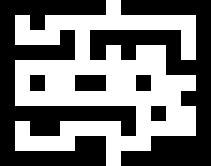

# Maze Generator and Solver
An implementation of a maze generator and a maze solver, using the A* algorithm.

### Run
To run the application, clone the repository:
```
git clone https://github.com/luizaes/maze-solver.git maze 
```
Go into the according directory:
```
cd maze
```
And execute:
```
python main.py
```

#### Input
The maze solver takes as input an image, where the image must be formed only of black `RGBA (0, 0, 0, 255)` and white `RGBA (255, 255, 255, 255)` pixels. The black pixels represent obstacles and the white pixels represent paths.
The maze also must have only one entry at the top (first row of pixels) and one way out at the bottom (last row of pixels).
After running the program, you can choose in the menu if you want to either automatically generate a maze or use an existing image.
To automatically generate the maze, you need to inform the height and width of the image.

#### Input Example

#### Output Example


#### Dependencies
[PIL](http://www.pythonware.com/products/pil/)

